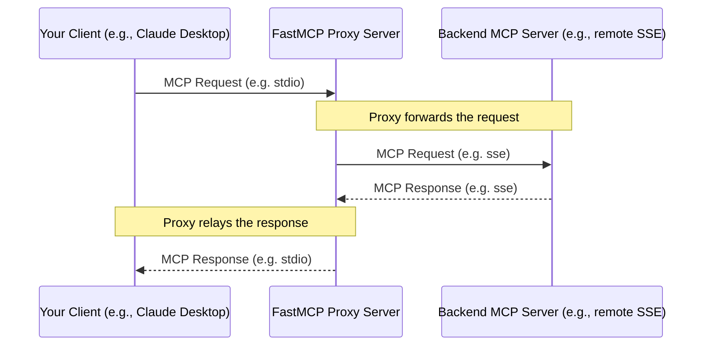

import { VersionBadge } from '/snippets/version-badge.mdx'

<VersionBadge version="2.0.0" />

FastMCP provides a powerful proxying capability that allows one FastMCP server instance to act as a frontend for another MCP server (which could be remote, running on a different transport, or even another FastMCP instance). This is achieved using the `FastMCP.from_client()` class method.

## What is Proxying?

Proxying means setting up a FastMCP server that doesn't implement its own tools or resources directly. Instead, when it receives a request (like `tools/call` or `resources/read`), it forwards that request to a *backend* MCP server, receives the response, and then relays that response back to the original client.



### Use Cases

-   **Transport Bridging**: Expose a server running on one transport (e.g., a remote SSE server) via a different transport (e.g., local Stdio for Claude Desktop).
-   **Adding Functionality**: Insert a layer in front of an existing server to add caching, logging, authentication, or modify requests/responses (though direct modification requires subclassing `FastMCPProxy`).
-   **Security Boundary**: Use the proxy as a controlled gateway to an internal server.
-   **Simplifying Client Configuration**: Provide a single, stable endpoint (the proxy) even if the backend server's location or transport changes.

## Creating a Proxy

The easiest way to create a proxy is using the `FastMCP.from_client()` class method. This creates a standard FastMCP server that forwards requests to another MCP server.

```python
from fastmcp import FastMCP, Client

# Create a client configured to talk to the backend server
# This could be any MCP server - remote, local, or using any transport
backend_client = Client("backend_server.py")  # Could be "http://remote.server/sse", etc.

# Create the proxy server with from_client()
proxy_server = FastMCP.from_client(
    backend_client,
    name="MyProxyServer"  # Optional settings for the proxy
)

# That's it! You now have a proxy FastMCP server that can be used
# with any transport (SSE, stdio, etc.) just like any other FastMCP server
```

**How `from_client` Works:**

1.  It connects to the backend server using the provided client.
2.  It discovers all the tools, resources, resource templates, and prompts available on the backend server.
3.  It creates corresponding "proxy" components that forward requests to the backend.
4.  It returns a standard `FastMCP` server instance that can be used like any other.

<Note>
Currently, proxying focuses primarily on exposing the major MCP objects (tools, resources, templates, and prompts). Some advanced MCP features like notifications and sampling are not fully supported in proxies in the current version. Support for these additional features may be added in future releases.
</Note>

### Bridging Transports

A common use case is to bridge transports. For example, making a remote SSE server available locally via Stdio:

```python
from fastmcp import FastMCP, Client

# Client targeting a remote SSE server
client = Client("http://example.com/mcp/sse")

# Create a proxy server - it's just a regular FastMCP server
proxy = FastMCP.from_client(client, name="SSE to Stdio Proxy")

# The proxy can now be used with any transport
# No special handling needed - it works like any FastMCP server
```

### In-Memory Proxies

You can also proxy an in-memory `FastMCP` instance, which is useful for adjusting the configuration or behavior of a server you don't completely control.

```python
from fastmcp import FastMCP

# Original server
original_server = FastMCP(name="Original")

@original_server.tool()
def tool_a() -> str: 
    return "A"

# Create a proxy of the original server
proxy = FastMCP.from_client(
    original_server,
    name="Proxy Server"
)

# proxy is now a regular FastMCP server that forwards
# requests to original_server
```

## `FastMCPProxy` Class

Internally, `FastMCP.from_client()` uses the `FastMCPProxy` class. You generally don't need to interact with this class directly, but it's available if needed.

Using the class directly might be necessary for advanced scenarios, like subclassing `FastMCPProxy` to add custom logic before or after forwarding requests. 